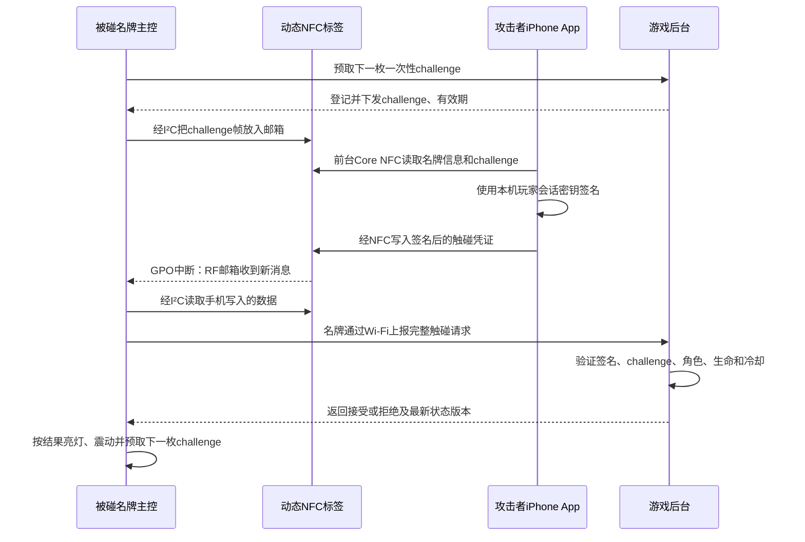

# 线下鹅鸭杀智能名牌硬件系统研发交接文档

> 文档状态：架构修正版
> 更新时间：2026-09-13
> 目标读者：接手 iPhone NFC、嵌入式硬件和后台联调的新对话/研发人员

## 0. 给新对话的直接任务

> 请先完整阅读本文件、`docs/MVP_SCOPE.md` 和当前项目代码。正确架构是：手机只通过 NFC 与被碰名牌交换数据，不直接向后台提交击杀；被碰名牌的 NFC 芯片把手机写入的数据交给主控，主控再通过 Wi-Fi 向后台上报。后台校验角色、生命、冷却和防重放规则，并把判定结果返回名牌。请先用一台 iPhone、一块带 Wi-Fi 的开发板和一块动态 NFC 标签板完成单台闭环，不要一开始画正式 PCB、上电池或制作外壳。

## 1. 最终确认的系统分工

用户要求的不是“手机读标签后由手机请求后台”，而是：

```text
攻击者手机
   │ NFC 近场读写
   ▼
被碰名牌中的动态 NFC 标签芯片
   │ I²C + 中断
   ▼
被碰名牌的 Wi-Fi 主控
   │ Wi-Fi 上报
   ▼
游戏后台进行最终判定
```

各部分职责如下：

| 组成 | 职责 |
|---|---|
| 攻击者手机 | 在前台 App 中靠近目标名牌，读取名牌挑战并写入本次触碰凭证；不直接提交击杀接口 |
| 动态 NFC 标签芯片 | 同时连接手机的 NFC 射频接口和名牌主控的 I²C 接口；将双方数据通过邮箱传递，并用中断通知主控 |
| 被碰名牌主控 | 读取手机写入的数据，以本机 `deviceId` 通过 Wi-Fi 上报后台，接收后台判定并驱动反馈 |
| 后台 | 验证手机身份凭证、名牌挑战、时效、防重放、角色、生命、阵营和冷却，记录唯一结果 |
| 裁判台 | 绑定设备与玩家、查看在线和电量、复活、暂停、纠错和处理异常 |

名牌上传的准确名称应是“触碰/击杀尝试”，而不是名牌自行认定的“击杀成功”。最终是否死亡仍由后台判定，否则任何手机靠近都可能直接把玩家杀死。

## 2. 为什么普通 NFC 贴纸不够

普通 NTAG213 贴纸是独立的被动存储器。手机可以读取它，但贴纸没有连接主控的 I²C 接口，也没有可以通知主控的中断脚。因此：

- 手机碰普通贴纸时，ESP32 不知道发生过触碰；
- 贴纸不能主动通过 Wi-Fi 发消息；
- 仅检测 NFC 射频场只能知道“附近出现过 NFC 设备”，无法知道是谁、是不是坏人，也无法执行个人冷却；
- 继续使用网址 NDEF 仍会留下系统通知和延迟点击问题。

本方案需要的是**动态/双接口 NFC 标签芯片**，不是 PN532、PN7160 一类主动 NFC 读卡器。推荐优先验证 ST25DV04KC：它属于 NFC Forum Type 5 标签，同时提供 RF、I²C、256 字节邮箱和可配置 GPO 中断。手机仍然是 NFC 主动端，名牌不需要产生 NFC 射频场。

## 3. 最小硬件组成

### 3.1 第一版核心器件

- 一颗自带 Wi-Fi 的主控，优先从 ESP32-C3 开发板开始；
- 一颗动态 NFC 标签芯片，优先验证 ST25DV04KC；
- 一副与 NFC 芯片匹配的 13.56 MHz 天线、匹配/调谐网络和射频测试点；
- I²C 上拉、GPO 上拉/电平兼容电路；
- 一颗 RGB LED；
- 一个震动马达及 MOSFET/驱动电路；
- 一个功能按键；
- 一块单节锂电池；
- 充电、电池保护、稳压和必要的 ESD/去耦电路；
- 蜂鸣器及其驱动作为可选件。

主控和 Wi-Fi 不必拆成两个芯片。ESP32-C3 一颗芯片就可以完成控制与联网。动态 NFC 标签芯片则不能省略，因为它是“手机碰名牌后，由名牌自己上报”的桥梁。

### 3.2 推荐连接

```text
ST25DV04KC + NFC 天线
 ├─ RF/NFC  ⇄ iPhone 前台 App
 ├─ I²C     ⇄ ESP32-C3
 └─ GPO/INT  → ESP32-C3 中断输入

ESP32-C3
 ├─ Wi-Fi   ⇄ 本地游戏后台
 ├─ GPIO/PWM → RGB LED
 ├─ GPIO     → 马达驱动 → 震动马达
 ├─ GPIO     ← 功能按键
 ├─ ADC/I²C  ← 电池电量检测
 └─ GPIO/PWM → 可选蜂鸣器驱动

USB-C / 充电触点
 └─ 充电与电源路径 → 带保护锂电池 → 稳压 → 全部电路
```

震动马达不能直接接 GPIO。Wi-Fi 发射、LED 和马达启动会产生峰值电流，电池、稳压、走线和去耦必须按峰值设计。

## 4. 推荐的 NFC 交互流程

### 4.1 为什么不能只用“检测到手机磁场”

若 GPO 只配置成 RF 场检测，任何 NFC 手机甚至读卡器靠近都会触发名牌。后台只能知道哪块名牌被碰，无法知道攻击者是谁。因此正式流程需要手机向动态 NFC 标签写入可验证的数据。

### 4.2 推荐的挑战—响应流程



手机不调用“击杀提交 API”。它只通过 NFC 把凭证交给被碰名牌；真正向后台发送触碰请求的是被碰名牌。

这里要区分“谁负责联网发送”和“谁负责判定结果”：**联网发送者是被碰名牌，最终裁决者仍是后台**。名牌上报的是带签名的触碰证据，而不是未经校验的“我已死亡”结论；否则单台设备无法可靠掌握攻击者角色、个人冷却和其他名牌的并发状态。

### 4.3 为什么需要一次性 challenge

如果手机每次只写固定的 `actorId`，其他人可以复制这段数据反复使用。后台提前为指定名牌签发并登记一次性 challenge，名牌将其放入 NFC 邮箱。手机签名时必须把以下内容一起签入：

```text
gameId + targetDeviceId + challenge + actorSessionId + actionType
```

后台对 challenge 执行原子的“校验 + 消费”：它必须属于当前游戏和目标名牌、在服务端有效期内且从未消费。同一 challenge 的并发请求最多一个进入业务判定。签名有效的请求无论因角色、冷却等业务规则成功或失败，都消费该 challenge；乱码、校验失败或无效签名不消费，名牌清理响应并恢复原挑战帧。challenge 超时或消费后，名牌从后台预取下一枚。

名牌维护 `EMPTY → READY → PHONE_READING → RESPONSE_READY → UPLOADING → CONSUMED/READY` 状态。设备向后台重试同一请求时必须复用同一 `requestId`；手机未完整读走 challenge 前，邮箱不能切换为响应方向。中断丢失时，主控还要轮询邮箱状态，并在 NFC 会话中断或超时后清理邮箱、恢复有效挑战。

上电初始化时，ESP32 必须通过 I²C 启用 Fast Transfer Mode 邮箱，并把 GPO 配置为手机写入 RF 邮箱（`RF_PUT_MSG`）等所需事件；GPO 按 KC 芯片供电域和数据手册完成上拉、电平匹配与边沿中断配置。GPO 只是事件提示，固件不能把单个脉冲当作唯一事实来源，仍需读取邮箱状态寄存器确认消息。第一版采用严格半双工握手：名牌先写挑战帧，手机完整读取并释放邮箱后才能写响应帧；超时则清理邮箱并恢复仍有效的挑战。

手机身份不能只靠可修改的明文 `actorId`。建议先锁定一条协议基线：App 为设备生成不可导出的 P-256 私钥，后台把对应公钥和本局 `actorSessionId` 绑定；手机对当前目标和 challenge 签名，后台验签。POC 可以先用测试密钥验证链路，但正式版必须定义密钥注册、吊销和玩家换机流程。

## 5. iPhone 兼容性与操作限制

该方向兼容 iPhone，但玩家需要使用前台原生 App 发起 NFC 会话：

- Apple Core NFC 支持读取和写入可写 NFC 标签；
- Core NFC 支持 ISO 15693，而 ST25DV04KC 是 NFC Forum Type 5 / ISO 15693 动态标签；
- ST 官方提供过 iPhone 与 ST25DV-I2C/单片机使用快速传输邮箱建立双向安全通道的演示；
- POC 应使用前台 `NFCTagReaderSession`、`NFCISO15693Tag` 以及 ST 的自定义邮箱命令/官方示例，并配置 NFC entitlement；普通 NDEF 读写接口不等同于 FTM 邮箱接口；
- ST 示例可证明技术路线可行，但 ST25DV04KC 的寄存器和驱动仍要按 KC 数据手册适配，不能假设旧示例代码无需修改即可运行；
- 正式交互使用协议数据或邮箱，不使用会遗留系统通知的普通网址 NDEF；
- 不能指望 iPhone 锁屏后无感地完成自定义双向数据交换，玩家需要先打开 App 的“攻击/扫描”界面再碰名牌。

因此，“手机不向后台发送击杀”可以做到，但“手机完全不运行 App、随便锁屏碰一下”不适合这个可验证方案。

## 6. NFC 帧与签名基线

ST25DV 快速传输邮箱容量为 256 字节，不能直接塞入带长字符串和 Base64 签名的 JSON。NFC 链路优先使用单帧、定长、大端序二进制协议，POC 先按下面的上限实现。

### 6.1 名牌写给手机的挑战帧（40 字节）

| 字段 | 字节数 |
|---|---:|
| magic `GD` | 2 |
| version | 1 |
| messageType = challenge | 1 |
| gameId（后台分配的 `uint32`） | 4 |
| targetDeviceId（后台分配的 `uint32`） | 4 |
| challengeId | 8 |
| challengeNonce | 16 |
| CRC32 | 4 |

### 6.2 手机写回名牌的响应帧（117 字节）

| 字段 | 字节数 |
|---|---:|
| magic `GD` | 2 |
| version | 1 |
| messageType = action | 1 |
| gameId | 4 |
| targetDeviceId | 4 |
| challengeId | 8 |
| challengeNonce | 16 |
| actorSessionId（后台分配的 `uint64`） | 8 |
| actionType | 1 |
| keyId | 4 |
| P-256 原始签名 `r || s` | 64 |
| CRC32 | 4 |

签名输入固定为 ASCII 域分隔符 `GOOSEKILL-V1`，后接响应帧中从 `version` 到 `keyId` 的规范大端序字节；哈希使用 SHA-256，签名使用 ECDSA P-256，并固定使用 64 字节原始 `r || s`，不使用长度会变化的 DER 编码。CRC32 仅用于发现传输损坏，不代替签名。

117 字节能完整放入 256 字节邮箱，第一版不做分片。任何新增字段都必须先重新计算最大帧长，不能临时改回 JSON。

### 6.3 名牌向后台上传

Wi-Fi 链路不受 256 字节邮箱限制，可以使用 JSON/CBOR，至少包含：`requestId`、设备认证后的 `deviceId`、`stateVersion`、117 字节 NFC 响应帧、设备运行时长和 RSSI。后台使用自己的 challenge 签发/失效记录和请求接收时间，不信任手机或名牌上传的墙上时间，并对 `requestId`、签名和 challenge 做幂等/防重放处理。

## 7. 后台判定与状态反馈

后台收到名牌上传后至少校验：

- 名牌属于当前游戏且在线；
- 手机凭证的签名有效并属于本局玩家；
- `targetDeviceId` 与实际上传设备一致；
- challenge 是该名牌当前值、未过期且未使用；
- 当前处于允许行动的阶段；
- 攻击者角色具有击杀能力并且存活；
- 目标存活、不是自己且满足阵营规则；
- 攻击者个人冷却结束；
- 同一目标并发请求只成功一次。

建议反馈：

| 结果/状态 | RGB LED | 震动 | 可选蜂鸣器 |
|---|---|---|---|
| 击杀成立，目标死亡 | 红灯/红色呼吸 | 强震或多段震动 | 可选两声短音 |
| 请求被拒绝 | 保持当前生命状态 | 一次很短的失败震动或不提示 | 默认无声 |
| 裁判复活 | 恢复绿色状态 | 双短震 | 可选短音 |
| 断网 | 黄/紫慢闪 | 按键查询时提示 | 无 |
| 低电量 | 与死亡不同的短闪 | 按键查询时提示 | 无 |

拒绝原因不应通过目标名牌公开攻击者的隐藏身份。第一版攻击者 App 在 NFC 写入成功后只显示“凭证已交给名牌”，不能把它显示成“击杀成功”；权威结果只由后台返回目标名牌。若后续确实要让攻击者看到结果，再增加独立的结果订阅/查询通道，或设计第二次 NFC 回读，不把它混入第一版闭环。

## 8. Wi-Fi 通信和设备状态

每块名牌具有唯一 `deviceId` 和独立设备密钥。后台维护：

```text
deviceId → 当前 gameId → 当前 playerId → 生命状态 → stateVersion
```

两台原型可以先用 WebSocket；扩展到多台后再比较 MQTT。无论哪种协议都要有：

- 设备认证；
- 心跳、电量、Wi-Fi 信号和固件版本上报；
- 请求 ID 与幂等处理；
- 后台响应 ACK；
- 断线重连后的全量状态同步；
- 单调递增的 `stateVersion`，防止旧命令覆盖新状态；
- 后台重启后设备自动恢复连接；
- 断网时触碰直接失败，不在恢复网络后补交旧击杀。

名牌即使本地收到 NFC 数据，也必须等待后台接受后才能进入“死亡”状态。

## 9. 按键、电池与充电

### 9.1 按键建议

- 短按：显示联网、电量和生命状态；
- 长按 2—3 秒：呼叫裁判或上报设备异常；
- 开机时按住：进入配网/维护模式；
- 游戏中禁止通过按键本地复活、改身份或清密钥。

### 9.2 原型电源顺序

第一阶段先用 USB 给开发板供电，把 NFC 邮箱和 Wi-Fi 链路跑通。第二阶段再加入：

- 带保护板的单节 3.7 V 锂聚合物电池；
- USB-C 5 V 输入；
- 带限流、温度检测和电源路径能力的充电方案；
- 电池电量检测；
- 峰值电流和最低电压测试。

容量按实测平均电流估算：

```text
所需标称容量 ≈ 平均工作电流 × 目标小时数 ÷ 0.7～0.8
```

正式运营可保留 USB-C 维护口，并增加防反接充电触点和 20—24 槽集中充电架。无线充电首版不建议采用，会增加厚度、损耗、发热并干扰 NFC 天线布局。

## 10. 推荐开发顺序

### 阶段 A：验证 NFC 桥梁

只准备：一台支持 Core NFC 的 iPhone、一块 ST25DV04KC 动态标签开发板、一块 ESP32-C3 开发板和 USB 供电。

验收：

- iPhone App 能读到 ESP32 经 I²C 放入邮箱的 challenge；
- iPhone 能把一段测试凭证写回邮箱；
- ESP32 能初始化 FTM 邮箱，并将 GPO 配置为 `RF_PUT_MSG` 事件；
- ST25DV 的 GPO 能触发 ESP32 边沿中断，漏掉中断时轮询仍能发现消息；
- ESP32 能完整、无误地读出手机写入的数据；
- 严格验证“名牌写 40 字节挑战 → 手机读完 → 手机写 117 字节响应”的半双工顺序、帧长和 CRC；
- 连续触碰 100 次，无粘包、错包和重复处理。

这一阶段成功前，不采购批量电池、不画 PCB。

### 阶段 B：单台完整闭环

- ESP32 连接现有后台；
- 名牌向后台预取已登记、绑定本机且带有效期的 challenge；
- 手机读挑战、签名并通过 NFC 写回；
- 名牌而不是手机向后台发送触碰证据并接收判定结果；
- 后台接受后名牌亮红灯并震动；
- 旧 challenge、重复凭证、错误角色和冷却中请求全部拒绝；
- 断网触碰失败，恢复后不补交；
- 旧网页 URL 和历史系统通知不能形成正式击杀。

### 阶段 C：两台及并发验证

- 两台名牌分别绑定两个玩家；
- 凭证中的目标 ID 必须与实际上报设备一致；
- 同一目标并发攻击只成功一次；
- 断线重连和后台重启后状态一致；
- 从 NFC 写入完成到名牌开始反馈，初始目标 P95 小于 1 秒、最大不超过 2 秒。

### 阶段 D：电池、现场和 PCB

先完成电池/充电 POC，再制作 6—8 台模块样机进行真实场地测试。射频、续航、Wi-Fi 覆盖和佩戴方式稳定后，才制作少量首版 PCB；修正版确认后再做约 20—24 台工程样机。

## 11. 造型设计约束

- 手机碰触区要明显，并位于名牌外侧；
- NFC 天线附近避免金属、磁铁、电池和大面积铜；
- ESP32 天线与 NFC 天线、电池和人体保持合理距离；
- RGB LED 使用扩散结构，死亡状态从数米外可见；
- 震动马达与壳体可靠连接；
- 使用圆角和可脱离安全挂绳/夹具；
- 电子内胆与主题面板分离，方便维修和换皮；
- 首版可拆卸维护，不要过早胶封或注塑。

最终壳体必须在真机验证 iPhone NFC 距离、人体佩戴影响和 Wi-Fi 信号之后再定型。

## 12. 新对话首先确认的问题

1. 是否接受攻击者必须打开 iPhone App 的“攻击/扫描”界面再碰名牌？
2. 是否必须识别具体攻击者并执行每人独立冷却？若是，手机签名凭证不可省略。
3. 手机在游戏中是否始终联网？即使不提交击杀，它仍可能需要登录和刷新凭证。
4. 第一版只支持 iPhone，还是同时支持 Android？最低系统和机型是什么？
5. 按键最终用于状态查询、呼叫裁判还是报尸？
6. 存活灯是否常亮，死亡灯是否保持到裁判复活？
7. 单次运营需要连续工作几小时？
8. 名牌采用挂绳、胸夹还是腕带？最大尺寸和重量是多少？
9. 现场是否使用专用路由器？覆盖几层和多大面积？
10. 蜂鸣器是否完全删除，还是只预留焊盘？
11. 第一版是否需要 OTA，还是赛后经 USB 更新即可？
12. 单台原型和 20 台工程样机的预算分别是多少？

## 13. 当前项目的改造边界

现有 `nfc-mvp/` 中的 Next.js + SQLite 后台可以继续复用玩家、阶段、生命、冷却、事件记录和裁判修正逻辑，但正式击杀入口需要改变：

- 玩家网页不能再直接调用正式击杀接口；
- 新接口只接受经过设备认证的名牌上报；
- 名牌上报中必须携带手机通过 NFC 写入的可验证凭证；
- 后台验证名牌身份、手机身份、目标 challenge 和业务规则后才改变生命状态；
- 原来的静态 URL 击杀入口应关闭或仅保留为裁判调试功能。

相关资料：

- 网页 MVP 范围：`docs/MVP_SCOPE.md`
- 环境说明：`docs/ENVIRONMENT.md`
- 原 NFC 测试手册：`docs/NFC标签录入与现场测试说明书.md`
- 上级目录原理文档：`../NFC原理与V1名牌击杀方案.md`
- 上级目录玩法框架：`../offline-goose-duck-v1-execution-framework-current (1).md`

## 14. 官方技术依据

- Apple Core NFC：支持读取和写入 NDEF 标签，并支持 ISO 15693 等协议标签：<https://developer.apple.com/documentation/CoreNFC>
- ST25DV04KC：动态 NFC/RFID 标签，提供 RF、I²C、256 字节邮箱和 GPO 事件输出：<https://www.st.com/en/nfc/st25dv04kc.html>
- ST iPhone 安全双向传输示例：使用 ST25DV-I2C 快速传输邮箱在 iPhone 与单片机间建立安全通道：<https://www.st.com/en/embedded-software/stsw-st25ios003.html>

## 15. 最终交接结论

最终方案是：**手机只经 NFC 把本次攻击凭证交给目标名牌；目标名牌通过动态 NFC 芯片的 I²C/中断取得凭证，再由自己的 Wi-Fi 主控上报后台；后台判定后，目标名牌亮灯和震动。**

因此最小设备不是单纯的“ESP32 + 灯 + 马达”，还必须增加一颗动态 NFC 标签芯片和天线。它不是主动读卡器，而是连接手机 NFC 与名牌主控的数据桥梁。
