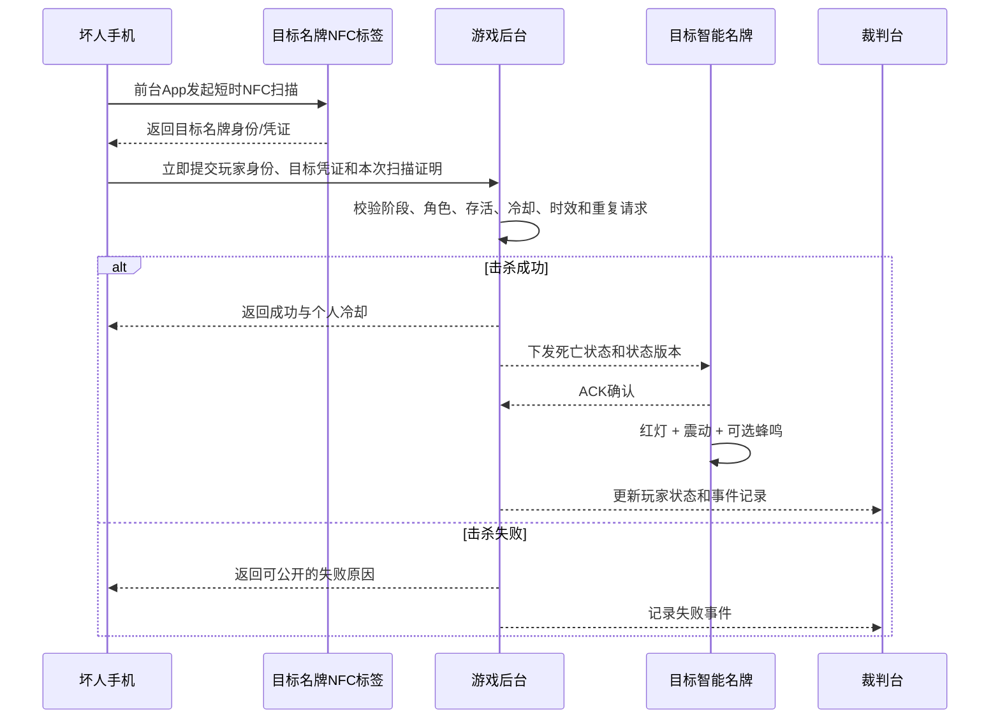

# 线下鹅鸭杀智能名牌硬件系统研发交接文档

> 文档状态：方向性交接稿
> 更新时间：2026-09-13
> 目标读者：接手手机端、嵌入式硬件和后台联调的新对话/研发人员

## 0. 给新对话的直接任务

请把本文件交给新的开发对话，并使用下面的提示：

> 请先完整阅读 `docs/智能名牌硬件系统研发交接文档.md`、`docs/MVP_SCOPE.md` 和当前项目代码。正确架构是：手机负责读取目标名牌中的被动 NFC 标签，并立即向后台发送击杀请求；智能名牌硬件不读取手机、不读取其他名牌，只通过 Wi-Fi 接收后台状态并用 RGB LED、震动反馈。第一版硬件应尽量简单：一颗自带 Wi-Fi 的主控、一个震动马达、一颗 RGB LED、一个按键、一块电池及必要的充电/保护/驱动电路，蜂鸣器可选。请先完成需求冻结、两台接收端原型方案、手机端防延迟提交方案、设备通信协议、器件清单、功耗和充电估算。不要一开始就画正式 PCB 或制作最终外壳。

## 1. 背景与已经确定的方向

项目是约 18 人参与的线下鹅鸭杀。现有局域网网页 MVP 使用普通 NTAG213：坏人拿手机碰目标名牌，iPhone 显示网址通知，玩家点通知后由网页向后台提交击杀。

实际测试发现，iPhone 的网址通知会在离开目标后继续保留。玩家可以先碰名牌，再到其他位置点击旧通知，造成延迟击杀或“远程击杀”。静态网页地址还可能被复制和转发。

新的方向不是让两块名牌互相读取，也不是在名牌中增加 NFC 读卡器。正确分工如下：

| 组成 | 职责 |
|---|---|
| 手机 | 玩家主动靠近目标名牌；读取被动 NFC 标签；立即向后台提交击杀请求 |
| 被动 NFC 标签 | 固定在每个名牌中，向手机提供目标名牌身份或安全凭证；无需电池，也不连接主控 |
| 智能名牌电子部分 | 通过 Wi-Fi 接收后台下发的存活、死亡、复活、断网等状态，并产生灯光、震动和声音反馈 |
| 后台 | 保存角色、阵营、阶段、存活、冷却和事件；校验击杀；向目标名牌下发死亡状态 |
| 裁判台 | 分配名牌与玩家、查看在线和电量、切换阶段、复活、修正状态、处理异常 |

因此，智能名牌本质上是一个“联网状态接收器和反馈器”。它不负责判断谁能杀人，也不负责识别触碰它的是哪部手机。

## 2. 必须明确的防作弊前提

仅仅增加智能名牌，并不能自动解决旧通知延迟点击。要真正修复这个问题，手机端必须改变：

- 不能继续把普通 NDEF 网址通知作为正式击杀提交入口；
- 手机需要在一次明确的、短时有效的 NFC 扫描会话中读取标签；
- 读取成功后由手机端立即自动提交，不再让玩家稍后点击“确认击杀”；
- 后台只接受当前扫描会话产生、在很短时间内到达的请求；
- 手机端不能保存一条击杀请求，等网络恢复或玩家换位置后再补交。

在 iPhone 上，这通常意味着需要一个前台运行的原生 App，使用 Core NFC 发起扫描。普通网页收到系统 NFC 网址通知后，无法可靠证明玩家点击时仍靠近名牌。新对话必须把“手机 App/手机端实现方式”与硬件接收端一起设计，否则硬件只会显示死亡，但旧的远程提交漏洞仍然存在。

第一版可以继续使用普通标签验证流程，但其威胁模型必须写清楚：它只在玩家使用官方、未修改 App 的前提下，消除系统通知留存和人工延迟点击；它不能让后台从密码学上证明手机刚刚在现场读过标签，也不能防有人复制标签内容后在别处使用。若正式运营还要防克隆或恶意修改客户端，应再评估动态认证 NFC 标签或挑战—响应机制。

## 3. 智能名牌的最小硬件范围

一句话物料边界：**Wi-Fi 主控 + 震动马达 + RGB LED + 按键 + 电池**。此外只加入让这些部件安全工作的充电、保护、稳压和马达驱动小电路；蜂鸣器不作为第一版必需件。

### 3.1 用户提出的核心组成

- 一颗自带 Wi-Fi 的主控；
- 一颗 RGB LED 状态灯；
- 一个震动马达；
- 一个可自定义功能的按键；
- 一块可充电电池；
- 充电、电池保护和稳压电路；
- 一张独立的被动 NFC 标签，供手机读取。
- 可选蜂鸣器；确认确有声音提示需求后再焊接。

不建议把主控和 Wi-Fi 做成两个独立芯片。原型优先考虑 ESP32-C3 一类自带 Wi-Fi 的主控，一颗芯片同时完成逻辑控制和联网，可减少器件、体积和开发工作；只有在后续出现明确性能需求时再考虑 ESP32-S3 或独立通信模块。具体型号目前只是候选，正式选择前需要核对供货、功耗、GPIO、Flash、天线和开发工具。

不需要采购主动 NFC 读卡模块。PN532、PN7160 等读卡器不属于这个方案的最小硬件。

### 3.2 推荐的硬件连接

```text
带 Wi-Fi 的主控
 ├─ GPIO → LED
 ├─ GPIO → 马达驱动管/MOSFET → 震动马达
 ├─ GPIO/PWM → 可选蜂鸣器驱动 → 可选蜂鸣器
 ├─ GPIO ← 功能按键
 ├─ I²C ← 电量计（推荐）
 └─ Wi-Fi ↔ 本地后台

USB-C / 充电触点
 └─ 充电与电源路径管理 → 带保护锂电池 → 稳压 → 主控和外设

被动 NFC 标签
 └─ 独立粘贴在名牌指定区域，不与主控电连接
```

震动马达不能直接接主控 GPIO，应使用合适的驱动管和续流/保护设计。Wi-Fi 发射和马达启动会产生峰值电流，稳压器、电池、走线和去耦必须按峰值而不是平均值设计。

## 4. 完整业务流程



硬件名牌只接受后台签名/认证后的状态命令。它不能因为本地按键、重启或收到普通局域网消息就自行把玩家改成死亡或复活。

## 5. 名牌状态与反馈建议

| 状态/事件 | RGB LED | 震动 | 可选蜂鸣器 |
|---|---|---|---|
| 开机自检 | 依次短亮 | 短震一次 | 可选短音 |
| 存活且在线 | 低亮绿或间歇绿闪 | 无 | 无 |
| 被后台判定死亡 | 明显红灯/红色呼吸 | 强震或多段震动 | 两声短音，可配置关闭 |
| 裁判复活 | 恢复存活灯 | 双短震 | 可选短音 |
| 断网 | 紫色或黄色慢闪 | 查询状态时提示 | 默认无 |
| 低电量 | 与死亡完全不同的短闪节奏 | 查询状态时提示 | 默认无 |
| 充电中 | 橙色呼吸 | 无 | 无 |
| 已充满 | 绿色常亮一段时间后熄灭 | 无 | 无 |
| 收到裁判呼叫 | 自定义闪烁 | 自定义震动 | 可选 |

死亡和低电量不能使用相同灯光节奏。如后续安装蜂鸣器，每类声音均应允许裁判关闭，避免暴露位置或影响公聊。

### 5.1 功能按键建议

按键不用于确认击杀，击杀由手机端完成。推荐先定义为：

- 短按：用灯光/震动显示本机联网、电量和生命状态；
- 长按 2—3 秒：呼叫裁判或上报设备异常；
- 开机时按住：进入配网/维护模式；
- 游戏开始后锁定恢复出厂、清密钥等危险操作。

按键最终功能仍需用户确认，也可以后期映射为报尸、任务或角色技能，但这些属于新增业务范围。

## 6. 设备与后台通信

### 6.1 每台设备需要的身份

每台智能名牌应具有：

- 唯一 `deviceId`；
- 独立设备密钥或证书；
- 固件版本；
- 当前绑定的游戏和玩家；
- 当前后台状态版本 `stateVersion`；
- 电量、Wi-Fi 信号和最后心跳时间。

玩家角色和阵营只保存在后台。名牌只需要知道“显示存活还是死亡”等最小公开状态，避免设备丢失或调试接口泄露身份。

### 6.2 被动标签与电子名牌的绑定

后台必须维护完整映射，而不能只绑定电子设备：

```text
targetTagId → physicalBadgeId/deviceId → 当前 gameId 下的 playerId
```

POC 标签应写入带版本号的随机 `targetTagId`，使用非网址 NDEF 记录或 App 能识别的自定义数据格式；不要再把会弹出系统网址通知的 HTTPS 地址作为正式击杀载荷。赛前由裁判台同时扫描名牌二维码/设备编号和 NFC 标签完成配对，再把整套名牌分配给本局玩家。更换标签、电子内胆或玩家后必须重新绑定，旧绑定立即作废。是否永久锁定标签要等写入格式验证完成后再决定，锁定后无法修正错误。

裁判台应能显示 `targetTagId`、`deviceId` 和当前玩家的对应关系，并提供“点亮/震动指定名牌”的配对自检，避免标签贴错后后台判死 A、实际亮灯 B。

### 6.3 建议消息

设备上行：

- 启动/上线；
- 定期心跳；
- 电量和信号强度；
- 按键事件；
- 收到状态命令后的 ACK；
- 重启原因和故障码。

后台下行：

- 设置存活/死亡/复活状态；
- 设置 RGB LED、震动和可选蜂鸣模式；
- 全局静音或暂停；
- 请求立即上报状态；
- 配置心跳周期；
- 后期可选的固件升级通知。

### 6.4 实时通信候选

| 方案 | 优点 | 代价 | 适用阶段 |
|---|---|---|---|
| WebSocket | 与现有 Node 后台接近，双向通信直观 | 需要自己实现设备认证、重连和连接管理 | 两台原型可优先使用 |
| MQTT | 对多台嵌入式设备、订阅和重连较成熟 | 增加 Broker 和部署配置 | 6—18 台时重点比较 |
| 高频 HTTP 轮询 | 最容易临时验证 | 延迟、流量和功耗较差 | 仅作为调试备用，不建议正式使用 |

无论选择哪种方式，都必须实现：

- 消息序号和 `stateVersion`；
- 后台命令 ACK、超时重试；
- 断线重连后的全量状态同步；
- 每台设备独立认证和单独吊销；
- 后台重启后设备自动恢复连接；
- 设备只接受当前游戏后台的合法命令；
- 裁判台显示离线、低电、版本不一致和最后心跳。

如果死亡命令丢失，后台可能已经判死而名牌仍显示绿色。因此名牌不能只处理一次性通知；它要保存最新 `stateVersion`，并在心跳、重连或定期校验时与后台重新对齐。

## 7. 手机端与后台的防延迟提交

本节不是名牌硬件功能，但它决定反作弊是否真正成立。

一次手机击杀请求可以包含：

```json
{
  "requestId": "唯一请求ID",
  "gameId": "本局ID",
  "actorSessionId": "手机中已登录的玩家会话",
  "targetCredential": "官方App本次读取到的目标凭证",
  "scanSessionId": "本次短时扫描会话",
  "sessionChallenge": "后台签发的短期挑战",
  "clientUptimeMs": 123456
}
```

建议流程：

1. 手机 App 在玩家主动进入“扫描/击杀”动作时向后台申请短期挑战；
2. App 启动一次 Core NFC 前台扫描；
3. 读取成功后立即提交目标凭证和挑战；
4. 后台检查挑战未过期、未使用、属于当前玩家和当前游戏；
5. 后台使用自己的接收时间判定时效，不把手机时间当作可信安全时钟；
6. `requestId` 和挑战只能使用一次；
7. 网络断开时本次击杀直接失败，不能排队等待恢复后补交。

这里有两个不同的时间，不能混为一谈：

- 扫描会话/后台挑战有效期：必须足够玩家打开 NFC 扫描并把手机靠近名牌，具体时长通过现场测试确定；
- 读卡完成到请求到达：建议以 1—2 秒作为官方 App 的性能验收起点，由 App 埋点测量，不宣称后台能独立验证真实读卡时刻。

后台看到的是挑战签发时间和请求到达时间，看不到可信的 NFC 读取时刻。短期挑战限制提交会话和重复使用，但不会把静态 NTAG213 内容与“刚刚发生的读取”进行密码学绑定。后台仍要校验行动阶段、玩家角色、双方存活、自杀、同阵营、个人冷却和目标是否已被其他人先杀死。

若继续使用普通静态 NTAG213，技术玩家仍可能复制目标凭证。正式运营是否要升级 NTAG 424 DNA 等动态认证标签，需要结合作弊风险、成本和手机端开发难度单独决策。

## 8. 电池与充电方案

### 8.1 原型建议

- 使用带保护板的成品单节 3.7 V 锂聚合物电池；
- 使用 USB-C 5 V 输入，并正确配置 Type-C CC、电气保护和 ESD；
- 充电芯片选择带电源路径管理、充电限流和温度检测能力的产品；
- 使用电量计芯片向后台提供电量，避免把单点电压直接显示成精确百分比；
- 佩戴和游戏过程中原则上不充电，充电由工作人员在固定区域管理；
- 不使用来源不明的裸电芯，不在未经验证的封闭外壳中长时间边充边用。

BQ24074、MCP73871 一类充电芯片及 MAX17048 一类电量计可作为调研候选，但不是已经冻结的料号。画原理图前必须查数据手册、供货和参考设计。

### 8.2 运营充电优化

18 台设备逐个插拔 USB-C 容易漏充和损坏接口。推荐的长期方向是：

1. 每台名牌保留 USB-C，供开发、应急和维护；
2. 增加防反接的弹簧针或磁吸充电触点；
3. 制作 20—24 槽集中充电架，给正式玩家设备和备用机一起充电；
4. 每个槽位独立限流/保护，使用合规的集中电源；
5. 充电触点凹陷并绝缘分隔，防止钥匙或硬币短路；
6. 充电架或后台能看出未插好、充电中、已充满和异常设备。

无线充电暂不推荐：它增加体积、发热和损耗，还可能与名牌中的 NFC 天线相互影响。除非后期明确要求防水和完全无接口，否则优先使用 USB-C + 充电触点。

### 8.3 容量估算

先测两台原型的真实平均电流和峰值电流，再定电池：

```text
所需标称容量 ≈ 平均工作电流 × 目标小时数 ÷ 0.7～0.8
```

系数已经包含约 20%—30% 的转换损耗、老化和运营余量，不应再无意重复叠加一次。最终续航目标由用户确认，建议至少覆盖完整运营时段，并用 Wi-Fi 持续在线、真实灯光和震动条件做整机测试。

## 9. 后期造型设计

### 9.1 外观原则

- 所有玩家设备外观一致，不能通过外壳、灯色或按钮区别阵营；
- 正面提供玩家编号/昵称区域、生命灯扩散区域和手机 NFC 碰触标记；
- NFC 标签附近避免金属装饰、磁铁、电池和大面积铜；
- 外形使用圆角，避免奔跑和拥挤时产生尖锐碰撞；
- 使用可脱离安全挂绳或安全夹具，避免被拉扯造成危险；
- 按键可以盲按，但不能被衣物、桌面或手机轻易误按；
- 死亡灯应从几米外辨认，存活灯不宜持续高亮耗电。

### 9.2 结构原则

- “电子内胆”与主题装饰面板分开，后期更换主题不必重做电路；
- 被动 NFC 标签保持独立、可替换，并留出清晰的手机碰触区域；
- ESP32 天线和 NFC 标签彼此留出距离，并远离金属、电池和人体高遮挡位置；
- 震动马达与壳体可靠连接，让佩戴者能感受到而不是只在内部响；
- 如安装蜂鸣器，其开孔需兼顾音量、防尘和汗液；
- USB-C、充电触点、电源和复位入口便于工作人员维护，但不便于玩家误操作；
- 首版使用螺丝或可维护卡扣，不要过早胶封；
- 外壳保留设备编号、二维码和返修标识位置。

不要在 NFC 读取距离、Wi-Fi 信号、续航和佩戴方式尚未验证前冻结最终造型。金属材料、厚度、电池位置和人体遮挡都会影响性能。

## 10. 推荐研发阶段

### 阶段 A：需求冻结

确认第 12 节问题，明确使用时长、佩戴方式、灯光、按键、蜂鸣、网络、预算和手机 App 方案。

### 阶段 B1：两台 USB 供电接收端 POC

先不接锂电池，使用两块带 Wi-Fi 的开发板完成：

- 后台能分别识别两台设备；
- 裁判台能绑定“设备—玩家”；
- 后台下发死亡后，指定设备亮红灯并震动；如安装蜂鸣器则按配置发声；
- 另一台设备不受影响；
- 裁判复活后恢复存活状态；
- 断网、重连和后台重启后状态最终一致；
- 按键可以上报状态查询或呼叫裁判；
- 连续 100 次下发不串设备、不漏最终状态。

### 阶段 B2：手机 NFC 与后台闭环

- 手机通过前台 NFC 扫描读取目标标签并自动提交；
- 读取后不再出现可供稍后点击的击杀确认；
- 断网时失败且恢复后不补交；
- 重复提交、旧挑战、好人、冷却、自杀和已死亡目标均被拒绝；
- 旧 URL、复制的旧 URL 和历史系统通知均不能形成正式击杀；正式击杀接口只接受合法 App 会话和一次性挑战；
- 两人同时攻击同一目标时只结算一次；
- 从手机读取成功到目标名牌开始反馈，初始目标为 P95 小于 1 秒、最大不超过 2 秒，最终数值由现场测试冻结。

### 阶段 B3：电池和充电 POC

- 加入电池、充电、电量计和完整电源路径；
- 记录 Wi-Fi 发射、RGB LED、马达以及可选蜂鸣器工作时的峰值电流与最低电压；
- 在用户要求的时长内连续在线，不重启、不错误掉线；
- 电量上报趋势合理，低电提示与死亡提示不会混淆；
- 测量完整充电时间、外壳内最高温度和低电关机行为。

### 阶段 C：6—8 台模块/洞洞板现场样机

- 在真实场地测试 Wi-Fi 覆盖、移动重连和并发；
- 测试手机从不同角度和真实佩戴位置读取 NFC；
- 检查蜂鸣、震动和灯光是否泄露行为或影响交流；
- 完成一轮游戏并记录延迟、掉线、误判、电量和裁判修正；
- 根据数据冻结电池、按键和反馈模式。

### 阶段 D：定制 PCB 与工程样机

1. 先制作少量首版 EVT PCB，用于上电、射频、功耗和结构调试；
2. 修正版确认后，再制作 20—24 台工程样机，覆盖约 18 名玩家及备用设备；
3. 完整跑局并修复最严重的问题；
4. 电路和结构稳定后才进入正式造型、小批工艺或注塑评估。

## 11. 验收指标草案

以下是新对话应与用户共同冻结的初始指标，不是已经承诺的量产规格：

| 项目 | 初始验证目标 |
|---|---|
| 状态下发 | 连续 100 次指定设备状态变更，无串设备，最终状态全部一致 |
| 重连同步 | 设备恢复网络后自动取得后台最新 `stateVersion`，不保留错误生命状态 |
| 端到端延迟 | 手机读卡成功至目标反馈：P95 < 1 秒，最大 < 2 秒 |
| 防延迟提交 | 旧扫描挑战、重复请求和断网缓存请求全部拒绝 |
| 并发击杀 | 同一目标只产生一条成功击杀记录 |
| 电量显示 | 后台能识别低电设备；误差目标需结合电量计和电池实测冻结 |
| 续航 | 覆盖用户确认的完整运营时段，并保留 20%—30% 余量 |
| 误提示 | 死亡、低电和断网在颜色/节奏上可被测试人员稳定区分 |
| 安全 | 充电、满载和故障测试中无异常高温、鼓包、短路或裸露危险触点 |

## 12. 新对话必须先确认的问题

1. 手机端是否确定开发原生 iPhone/Android App？还是已有其他可以立即读取并提交 NFC 的载体？
2. 手机扫描前是否接受玩家先打开 App 并进入一次短时扫描界面？
3. 第一版只解决通知留存和延迟点击，还是必须同时防复制 NFC 标签？
4. 名牌采用挂绳、胸夹、腕带还是其他形式？最大尺寸和重量是多少？
5. 单次运营连续几小时，两局之间可充电多久？
6. 生命灯在存活时是否常亮？死亡后是否一直红灯到裁判复活？
7. 蜂鸣器是否默认开启？哪些场景必须静音？
8. 按键首要功能是状态查询、呼叫裁判、报尸还是其他动作？
9. 现场 Wi-Fi 是否可使用专用路由器？场地有几层、哪些区域需要覆盖？
10. 后台长期运行在笔记本、树莓派还是固定小主机？
11. 双机原型、8 台样机和 20 台工程样机的预算分别是多少？
12. 第一版是否需要 OTA，还是赛后通过 USB-C 统一更新即可？
13. 任务、报尸、投票、角色技能或定位是否也要通过名牌完成？这些应分别立项，不能默认加入本次最小范围。

## 13. 当前项目和资料

- 当前仓库：`nfc-mvp/`
- 网页 MVP 范围：`docs/MVP_SCOPE.md`
- 环境与技术栈：`docs/ENVIRONMENT.md`
- 原 NFC 测试手册：`docs/NFC标签录入与现场测试说明书.md`
- 上级目录原理文档：`../NFC原理与V1名牌击杀方案.md`
- 上级目录玩法框架：`../offline-goose-duck-v1-execution-framework-current (1).md`

现有 Next.js + SQLite 后台不要删除。玩家、阶段、存活、冷却、事件和裁判修正逻辑仍可复用。硬件接入后，需要关闭或严格限制玩家可访问的旧网页击杀入口，避免继续从静态网址绕过新的手机扫描流程。

## 14. 最终交接结论

当前目标是一个简单的智能名牌接收端，而不是复杂 NFC 读卡设备：**手机读取被动 NFC 标签并向后台发送，后台裁决，名牌通过 Wi-Fi 接收结果并用 RGB LED 和震动反馈；蜂鸣器只作为可选件。**

最稳妥的下一步是先用两块带 Wi-Fi 的开发板做接收端，再把手机前台 NFC 扫描接入现有后台。确认远程点击漏洞真正消失、状态下发可靠后，再加入锂电池和充电，最后才做定制 PCB 和造型。
